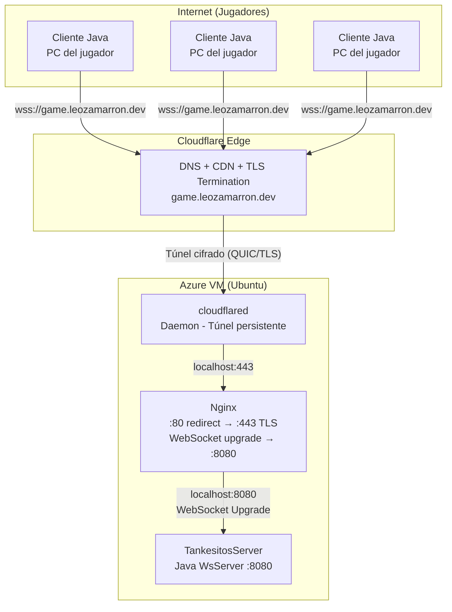
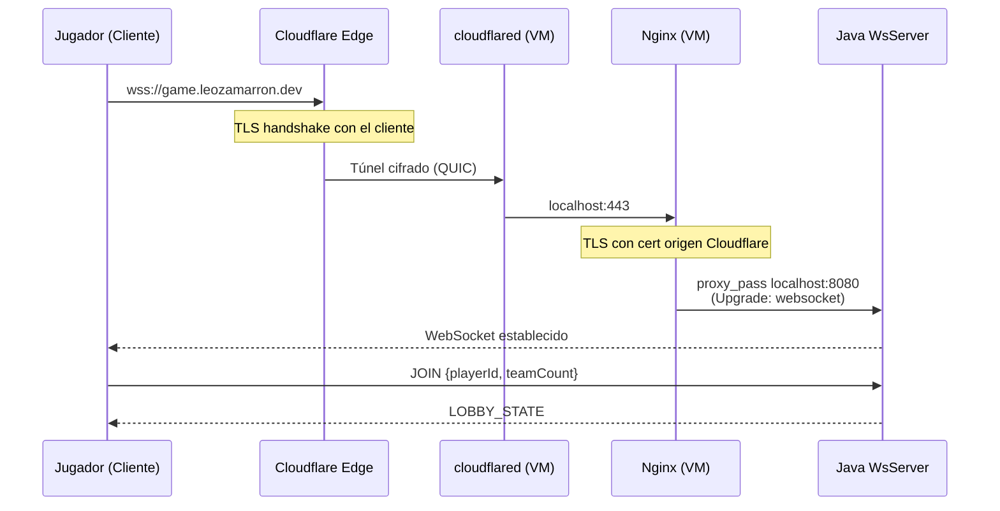

---
tags:
  - universidad
  - proyecto
  - tank-wars
  - arquitectura
  - azure
  - cloudflare
---

# Arquitectura General — Tank Wars

> [!tip] Navegación
> ← [[Documentación — Tank Wars|Índice]] | → [[Red e Infraestructura — Tank Wars|Red e Infraestructura]]

---

## Visión General

Tank Wars es un videojuego multijugador de tanques en tiempo real, construido en Java (Swing + WebSocket). La infraestructura combina una **VM en Azure**, **Nginx**, **Cloudflare Tunnel (cloudflared)** y la **CDN/DNS de Cloudflare** para ofrecer conectividad segura (WSS) a cualquier jugador en internet sin exponer directamente el IP de la VM.

---

## Diagrama de Arquitectura



---

## Capas de la Arquitectura

### 1. Capa de Infraestructura en la Nube

| Componente | Rol |
|---|---|
| **Azure VM** | Máquina virtual donde vive todo el backend del juego |
| **Cloudflare DNS** | Resuelve `game.leozamarron.dev` hacia la red de Cloudflare |
| **Cloudflare CDN/Proxy** | Protege la VM ocultando su IP real, termina TLS con el cliente |
| **cloudflared** | Daemon que mantiene un túnel cifrado entre Cloudflare y la VM |

### 2. Capa de Red en la VM

| Componente | Puerto | Función |
|---|---|---|
| **cloudflared** | interno | Recibe tráfico del túnel Cloudflare, lo pasa a nginx |
| **Nginx** | 80, 443 | Reverse proxy con TLS, actualización de protocolo a WebSocket |
| **Java WS Server** | 8080 | Servidor de juego WebSocket (solo accesible localmente) |

### 3. Capa de Aplicación

| Módulo | Lenguaje | Descripción |
|---|---|---|
| **TankesitosServer** | Java 11 | Servidor de juego, maneja lobby, partidas y mensajes |
| **ClientCloud** | Java 18 | Cliente de escritorio Swing con interfaz gráfica |

---

## Flujo de Conexión Paso a Paso



---

## Servicios en la VM

### systemd: tankesitos.service

```ini
[Unit]
Description=Tankesitos Game Server
After=network.target

[Service]
Type=simple
User=azureuser
WorkingDirectory=.../TankesitosServer
ExecStart=/usr/bin/java -jar target/TankesitosServer-1.0.jar
Restart=always
RestartSec=5
```

> [!note]
> El servidor se reinicia automáticamente si falla y arranca junto con el sistema.

### Nginx: game.leozamarron.dev

```nginx
server {
    listen 443 ssl;
    server_name game.leozamarron.dev;

    ssl_certificate     /etc/ssl/cloudflare/origin.pem;
    ssl_certificate_key /etc/ssl/cloudflare/origin.key;

    location / {
        proxy_pass http://127.0.0.1:8080;
        proxy_http_version 1.1;
        proxy_set_header Upgrade $http_upgrade;
        proxy_set_header Connection "Upgrade";
        proxy_read_timeout 86400;   # 24h — partidas largas
    }
}
```

---

## Dependencias del Proyecto

### Servidor (Java 11, Maven)

| Librería | Versión | Uso |
|---|---|---|
| `org.java-websocket` | 1.5.4 | Servidor WebSocket |
| `com.google.gson` | 2.10.1 | Serialización JSON |

### Cliente (Java 18, Maven)

| Librería | Versión | Uso |
|---|---|---|
| `org.java-websocket` | 1.5.4 | Cliente WebSocket |
| `com.google.gson` | 2.10.1 | Serialización JSON |
| `com.googlecode.soundlibs:mp3spi` | 1.9.5.4 | Reproducción de audio MP3 |

---

## Por Qué Esta Arquitectura

> [!important] Decisiones de diseño
> - **Cloudflare Tunnel** → La VM no tiene puerto público expuesto directamente, mejorando la seguridad y evitando ataques DDoS.
> - **Nginx** → Centraliza el TLS y el upgrade a WebSocket, desacoplando la capa de red del código Java.
> - **Systemd** → Garantiza que el servidor se levante automáticamente con la VM y se recupere ante fallos.
> - **WebSocket** → Comunicación bidireccional persistente y de baja latencia, ideal para videojuegos en tiempo real.

---

> [!tip] Navegación
> ← [[Documentación — Tank Wars|Índice]] | → [[Red e Infraestructura — Tank Wars|Red e Infraestructura]]
