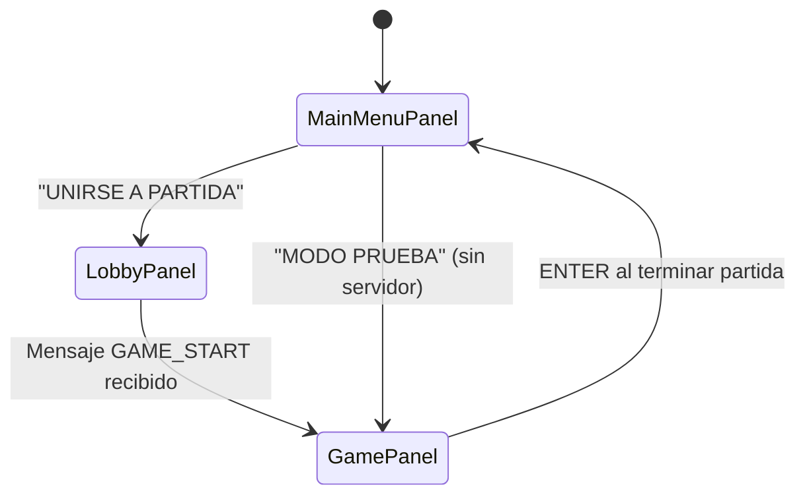
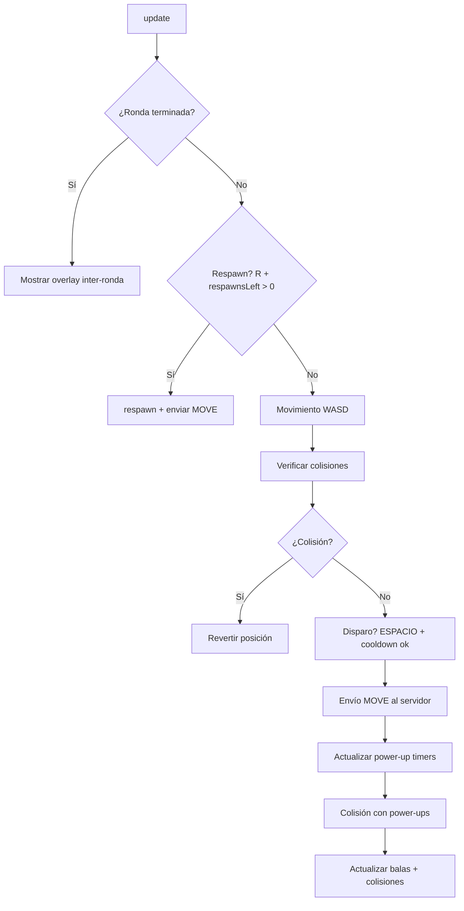

---
tags:
  - universidad
  - proyecto
  - tank-wars
  - cliente
  - java
  - swing
---

# Documentación del Cliente — ClientCloud

> [!tip] Navegación
> [[Documentación del Servidor — TankesitosServe|← Servidor]] | [[Documentación — Tank Wars|Índice]] | [[Flujo Completo del Juego — Tank Wars|Flujo →]]

---

## Estructura del Proyecto

```
ClientCloud/
└── src/main/java/client/
    ├── ClientCloud.java              ← Punto de entrada (main)
    ├── game/
    │   ├── GameWindow.java           ← JFrame raíz, router de pantallas
    │   ├── MainMenuPanel.java        ← Pantalla de menú principal
    │   ├── LobbyPanel.java           ← Sala de espera
    │   ├── GamePanel.java            ← Pantalla de juego (game loop)
    │   ├── GameMap.java              ← Mapa de tiles
    │   ├── HUD.java                  ← Interfaz en pantalla
    │   ├── KeyHandler.java           ← Captura de teclado
    │   ├── AssetLoader.java          ← Carga de imágenes y mapas
    │   └── SoundManager.java         ← Gestión de audio
    ├── net/
    │   ├── NetworkClient.java        ← Cliente WebSocket
    │   ├── GameMessage.java          ← Modelo de mensajes
    │   └── MessageType.java          ← Enumerado de tipos de mensaje
    └── entity/
        ├── Tank.java                 ← Entidad tanque
        ├── Bullet.java               ← Entidad bala
        ├── PowerUp.java              ← Entidad power-up
        ├── Explosion.java            ← Efecto de explosión
        └── Team.java                 ← Equipos con colores
```


## Recursos del Cliente

| Carpeta | Contenido |
|---|---|
| `resources/maps/` | Mapas del juego en formato texto |
| `resources/sonidosTank/` | Música y efectos de sonido |
| `resources/Sprites/` | Sprites de tanques, explosiones y balas |
| `resources/tiles/` | Texturas del terreno |

### Características Multimedia

El cliente incorpora recursos gráficos y de audio para mejorar
la experiencia multijugador:

- Música de fondo.
- Sonidos de disparos.
- Sonidos de impactos y explosiones.
- Sprites animados.
- Mapas renderizados mediante tiles.

---

## Navegación entre Pantallas



---

## `GameWindow` — Controlador Principal

Implementa `NetworkClient.EventListener` y actúa como puente entre la red y los paneles.

### URL del Servidor

```java
String serverUrl = loadEnvOrDefault("SERVER_URL", "wss://game.leozamarron.dev");
```

> [!note] Sobreescribir servidor
> Crear archivo `.env` en el directorio de trabajo:
> ```
> SERVER_URL=ws://localhost:8080
> ```

### Modo de Prueba (sin servidor)

Este modo fue utilizado durante el desarrollo para probar mecánicas
de movimiento, colisiones, renderizado y lógica de rondas sin necesidad
de levantar el servidor WebSocket.

Esto permitió acelerar el proceso de depuración y desarrollo del cliente.

El botón **"▶ MODO PRUEBA"** arranca el juego sin servidor:
- `net = null`
- Tecla **N** simula fin de ronda
- No hay otros jugadores remotos

---

## `NetworkClient` — Cliente WebSocket

### Ciclo de Conexión

```java
net.connect(playerName, "RED", teamCount);
// 1. Crea WebSocketClient con URI wss://game.leozamarron.dev
// 2. Lanza hilo daemon para la conexión
// 3. En onOpen → envía JOIN {playerId, teamCount}
// 4. En onMessage → deserializa JSON → dispatch()
```

### Despacho de Mensajes

| Mensaje Recibido | Acción |
|---|---|
| `LOBBY_STATE` | `listener.onLobbyState(msg)` |
| `GAME_START` | `listener.onGameStart(msg)` |
| `MOVE` / `STATE_UPDATE` | `onRemoteTankUpdate(...)` (filtra propios) |
| `SHOOT` | `onRemoteBullet(...)` (filtra propios) |
| `DEATH` | `onRemoteDeath(id)` |
| `DISCONNECT` | `onRemoteDisconnect(id)` |
| `SCORE_UPDATE` | `onScoreUpdate(r, b, g, y)` |
| `POWERUP_COLLECTED` | `onPowerUpCollected(index)` |
| `POWERUP_RESPAWN` | `onPowerUpRespawn(batch)` |
| `ROUND_END` / `ROUND_START` | Transiciones de ronda |

---

## `GamePanel` — El Juego

### Ciclo de Juego (60 FPS)

```java
run() {  // hilo "GameLoop"
    while (gameThread != null) {
        delta += (now - last) / (1_000_000_000.0 / 60);
        if (delta >= 1) {
            update();   // lógica
            repaint();  // render
            delta--;
        }
        Thread.sleep(1);
    }
}
```

### `update()` — Lógica por Frame



### Orden de Renderizado (de abajo hacia arriba)

1. `gameMap.draw()` — tiles del mapa
2. `powerUps.forEach(draw)` — power-ups
3. `remoteTanks.forEach(draw)` — tanques remotos
4. `localTank.draw()` — tanque local
5. `localTank.drawLocalMarker` — triángulo blanco indicador
6. `bullets.forEach(draw)` — balas
7. `explosions.forEach(draw)` — explosiones
8. **HUD** (coordenadas de pantalla, sin transformación)
9. **Overlays** (muerte / fin de ronda / fin de partida)

---

## `Tank` — Entidad Tanque

| Parámetro | Valor |
|---|---|
| Tamaño | 36 × 40 px |
| Velocidad avance | 2.5 px/frame (×2 con SPEED) |
| Velocidad retroceso | 1.5 px/frame |
| Velocidad rotación | 0.05 rad/frame |
| HP máximo | 100 |
| Cooldown disparo | 400 ms (100 ms con AMMO) |

### Posiciones de Spawn por Equipo

| Equipo | Esquina del mapa |
|---|---|
| RED | Arriba-izquierda |
| BLUE | Arriba-derecha |
| GREEN | Abajo-izquierda |
| YELLOW | Abajo-derecha |

> [!info]
> Cada equipo busca celdas libres en una cuadrícula de 6×6 desde su esquina. El jugador elige posición según el hash de su `playerId` para evitar solapamiento.

---

## `GameMap` — Mapa de Tiles

Los mapas se almacenan como archivos de texto (`.txt`) donde cada número
representa un tipo de tile específico.

Este enfoque permite:
- Crear mapas fácilmente.
- Modificar escenarios sin recompilar código.
- Reducir complejidad gráfica.
- Mantener un sistema flexible y escalable.

| Parámetro | Valor |
|---|---|
| `TILE_SIZE` | 48 px |
| Tiles sólidos | Códigos 1, 2, 4, 5, 6, 7 |
| Tiles libres | Código 0, 3, y otros |

### Mapas incluidos

| Archivo | Ronda |
|---|---|
| `/maps/bigBattleMap.txt` | 1 — Gran Batalla |
| `/maps/mapaVolcanico.txt` | 2 — Volcánico |
| `/maps/mapaHielo.txt` | 3 — Ártico |

---

## `PowerUp` — Power-Ups

| Tipo | Efecto | Duración |
|---|---|---|
| 🟢 SPEED | Velocidad ×2 | 5 segundos |
| ❤️ HEALTH | +40 HP | Instantáneo |
| 🛡️ IMMUNITY | Invulnerable | 4 segundos |
| 🔫 AMMO | Cooldown 100ms (×4 más rápido) | 8 segundos |

---

## Controles

| Tecla | Acción |
|---|---|
| **W** | Avanzar |
| **S** | Retroceder |
| **A** | Rotar izquierda |
| **D** | Rotar derecha |
| **ESPACIO** | Disparar |
| **R** | Reaparecer (máx 2 por ronda) |
| **N** | Simular fin de ronda (modo prueba) |
| **ENTER** | Volver al menú (pantalla de resultados) |

## Sistema de Audio

El cliente implementa un sistema de audio mediante `SoundManager`,
encargado de reproducir:

- Música de menú.
- Música de partida.
- Disparos.
- Explosiones.


El audio mejora la retroalimentación visual y la inmersión del jugador.

---

> [!tip] Navegación
> [[Documentación del Servidor — TankesitosServe|← Servidor]] | [[Documentación — Tank Wars|Índice]] | [[Flujo Completo del Juego — Tank Wars|Flujo →]]
