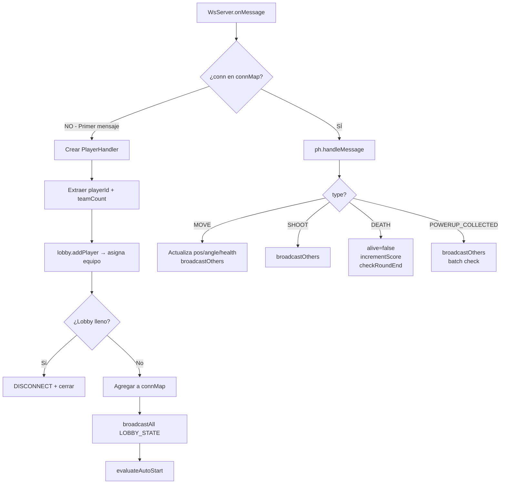
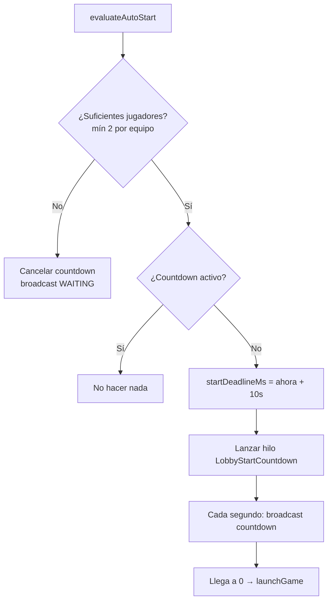
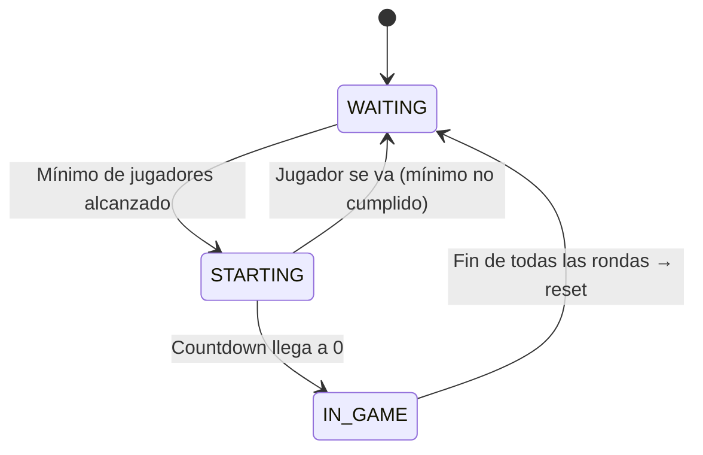

---
tags:
  - universidad
  - proyecto
  - tank-wars
  - servidor
  - java
  - websocket
---

# Documentación del Servidor — TankesitosServer

> [!tip] Navegación
> ← [[Documentación — Tank Wars|Índice]] | [[Documentación del Cliente — ClientCloud|Cliente →]]

---

## Estructura del Proyecto

```
TankesitosServer/
├── src/
│   ├── main/
│   │   ├── TankesitosServer.java   ← Punto de entrada (main)
│   │   ├── WsServer.java           ← Servidor WebSocket
│   │   ├── PlayerHandler.java      ← Lógica de jugadores y partida
│   │   ├── GameLobby.java          ← Gestión del lobby y rondas
│   │   ├── Player.java             ← POJO de jugador (heredado)
│   │   └── GamePanel.java          ← Configuración del mapa (heredado)
│   └── json/
│       ├── JSON_GameMessage.java   ← Modelo de mensajes JSON
│       ├── JSON_Player.java
│       ├── JSON_NewPlayer.java
│       ├── JSON_PlayerAuthentication.java
│       ├── JSON_LoadPlayers.java
│       └── JSON_Map.java
├── target/
│   └── TankesitosServer-1.0.jar   ← Fat JAR ejecutable
└── pom.xml
```

---

## Sincronización Cliente-Servidor

Cada cliente:
- Procesa lógica visual local.
- Renderiza entidades.
- Detecta entradas del usuario.
- Envía eventos importantes al servidor.

El servidor:
- Valida conexiones.
- Coordina el lobby.
- Controla rondas.
- Sincroniza eventos.
- Redistribuye información al resto de jugadores.

Este modelo permite mantener consistencia entre todos los clientes
conectados.


## Concurrencia y manejo multicliente

El servidor fue diseñado para soportar múltiples jugadores conectados
simultáneamente mediante WebSockets.

Debido a que cada cliente puede enviar mensajes al mismo tiempo,
fue necesario utilizar estructuras concurrentes para evitar
condiciones de carrera y corrupción de datos compartidos.

### Estructuras concurrentes utilizadas

| Estructura | Uso |
|---|---|
| `ConcurrentHashMap` | Asociación segura entre conexiones WebSocket y jugadores |
| `CopyOnWriteArrayList` | Lista segura de jugadores conectados |
| `AtomicInteger` | Manejo thread-safe de puntuaciones |
| `volatile` | Visibilidad inmediata entre hilos |

### Problemas que resuelve

Sin concurrencia adecuada podrían ocurrir problemas como:

- Sobreescritura de posiciones de jugadores.
- Inconsistencias en el lobby.
- Errores en puntuaciones.
- Desconexiones incorrectas.
- Corrupción del estado global de la partida.

### Modelo de ejecución

Cada conexión WebSocket es manejada mediante hilos internos de la librería
`org.java-websocket`, permitiendo que múltiples jugadores interactúen
con el servidor de manera simultánea.

El servidor centraliza la lógica compartida en `PlayerHandler`,
el cual actúa como coordinador del estado global de la partida.


## Clases Principales

### `TankesitosServer` — Punto de Entrada

```java
public static void main(String[] args) {
    WsServer server = new WsServer(8080);
    server.setReuseAddr(true);
    server.start();
}
```

Crea e inicia el servidor WebSocket en el puerto **8080**.

---

### `WsServer` — Servidor WebSocket

Extiende `org.java_websocket.server.WebSocketServer`. Escucha en `0.0.0.0:8080` y delega toda la lógica a `PlayerHandler`.

| Callback | Acción |
|---|---|
| `onOpen(conn, handshake)` | Registra la nueva conexión en el log |
| `onMessage(conn, message)` | Delega a `PlayerHandler.onMessage(conn, message)` |
| `onClose(conn, code, reason, remote)` | Delega a `PlayerHandler.onClose(conn)` |
| `onError(conn, ex)` | Imprime el error en stderr |
| `onStart()` | Log de confirmación de inicio |

---

### `PlayerHandler` — Lógica Central del Juego

> [!important]
> Esta es la clase más importante del servidor. Contiene **estado estático compartido** entre todos los jugadores y **estado de instancia** por jugador.

#### Estado Estático Compartido

```java
CopyOnWriteArrayList<PlayerHandler> playerHandlers   // Todos los handlers activos
ConcurrentHashMap<WebSocket, PlayerHandler> connMap   // Conexión → handler
GameLobby lobby                                      // El lobby único
AtomicInteger redScore, blueScore, greenScore, yellowScore  // Puntajes
volatile long gameSeed                               // Semilla RNG compartida
volatile long startDeadlineMs                        // Countdown (10s)
```

#### Estado por Instancia (por Jugador)

```java
String playerId       // Nombre del jugador
String team           // "RED" | "BLUE" | "GREEN" | "YELLOW"
double posX, posY     // Posición actual
double angle          // Ángulo de rotación (radianes)
int health            // HP actual (0–100)
boolean alive         // ¿Sigue con vida?
WebSocket conn        // Conexión WebSocket de este jugador
```

#### Flujo de un Mensaje Entrante



#### Lógica del Auto-Start



#### `launchGame()`

```java
lobby.startGame();  // state = IN_GAME, currentRound = 1
gameSeed = System.currentTimeMillis();
broadcastAll(JSON_GameMessage.gameStart(teamCount, mapResource, seed, players));
```

---

### `GameLobby` — Sala de Espera y Rondas

#### Configuración

| Constante | Valor | Descripción |
|---|---|---|
| `TOTAL_ROUNDS` | 3 | Número de rondas por partida |
| `MAX_PER_TEAM` | 3 | Máximo de jugadores por equipo |
| `MIN_PER_TEAM` | 2 | Mínimo para empezar |
| Equipos | RED, BLUE, GREEN, YELLOW | Hasta 4 equipos |

#### Mapas por Ronda

| Ronda | Archivo | Nombre |
|---|---|---|
| 1 | `/maps/bigBattleMap.txt` | Gran Batalla |
| 2 | `/maps/mapaVolcanico.txt` | Volcánico |
| 3 | `/maps/mapaHielo.txt` | Ártico |

#### Asignación de Equipos (Round-Robin)

Los jugadores se asignan de forma balanceada entre los equipos disponibles. El **primer jugador** en entrar determina cuántos equipos habrá.

```
Jugador 1 → RED
Jugador 2 → BLUE
Jugador 3 → RED
Jugador 4 → BLUE
...
```

#### Estados del Lobby



---

## Protocolo de Mensajes (`JSON_GameMessage`)

Todos los mensajes son JSON serializado con **Gson**. Campo `type` determina el tipo.

### Cliente → Servidor

| type | Campos | Descripción |
|---|---|---|
| `JOIN` | `playerId`, `teamCount` | Primer mensaje al conectar |
| `MOVE` | `playerId`, `team`, `x`, `y`, `angle`, `health`, `alive` | Actualización de posición/estado |
| `SHOOT` | `playerId`, `team`, `x`, `y`, `angle` | El jugador dispara |
| `DEATH` | `playerId` | El jugador murió |
| `POWERUP_COLLECTED` | `playerId`, `powerUpIndex` | Se recogió un power-up |

### Servidor → Cliente(s)

| type | Destino | Descripción |
|---|---|---|
| `LOBBY_STATE` | Todos | Estado actual del lobby |
| `GAME_START` | Todos | Inicia la partida |
| `MOVE` | Otros | Re-broadcast de movimiento |
| `SHOOT` | Otros | Re-broadcast de disparo |
| `DEATH` | Otros | Re-broadcast de muerte |
| `DISCONNECT` | Todos | Un jugador se desconectó |
| `SCORE_UPDATE` | Todos | Actualización de puntos |
| `POWERUP_COLLECTED` | Otros | Re-broadcast de recolección |
| `POWERUP_RESPAWN` | Todos | Nuevo lote de power-ups |
| `ROUND_END` | Todos | Fin de una ronda |
| `ROUND_START` | Todos | Inicio de siguiente ronda |

---

> [!tip] Navegación
> ← [[Documentación — Tank Wars|Índice]] | [[Documentación del Cliente — ClientCloud|Cliente →]]
