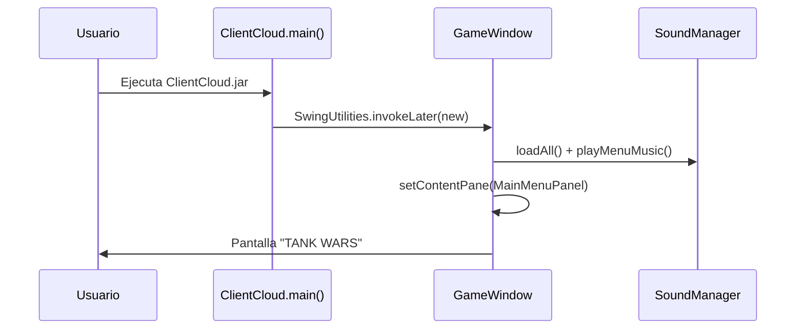
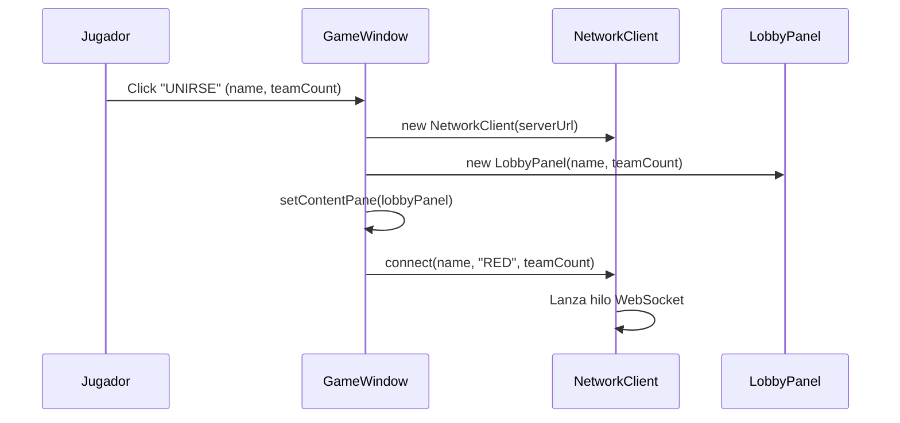
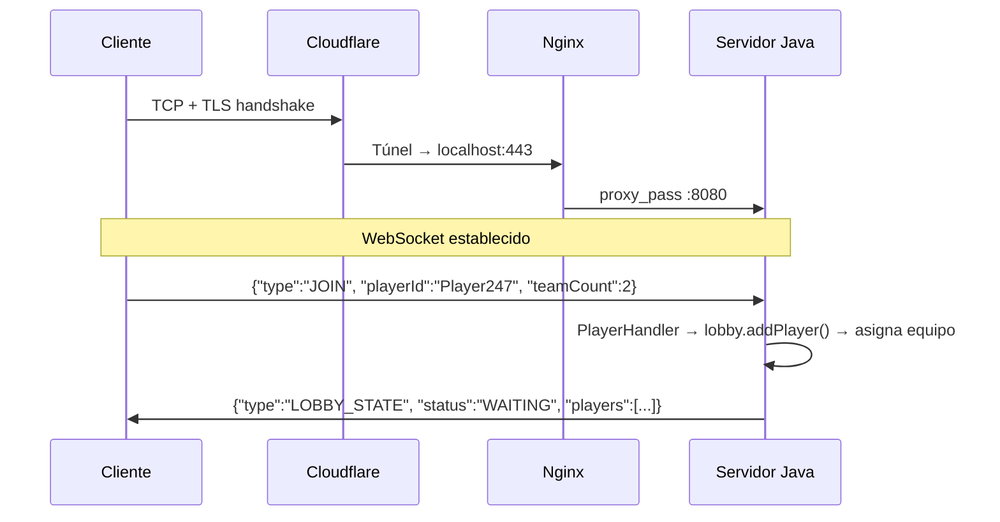
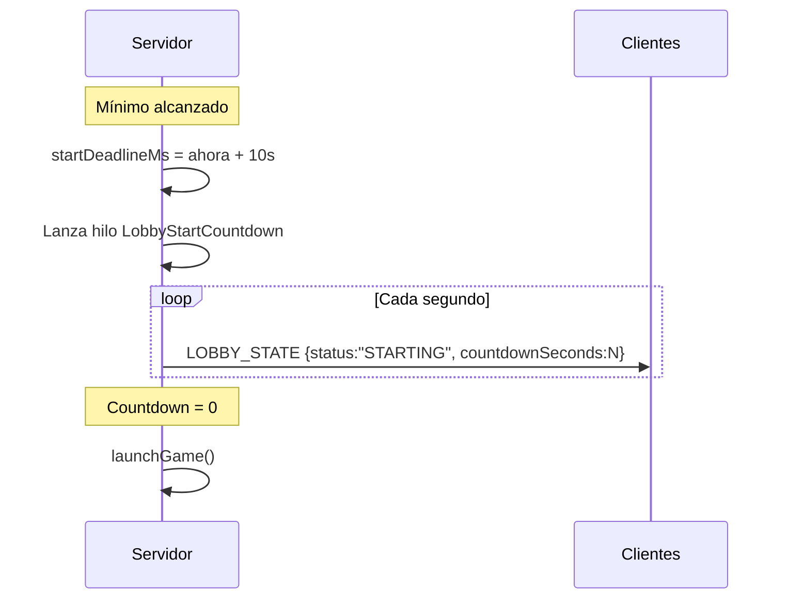
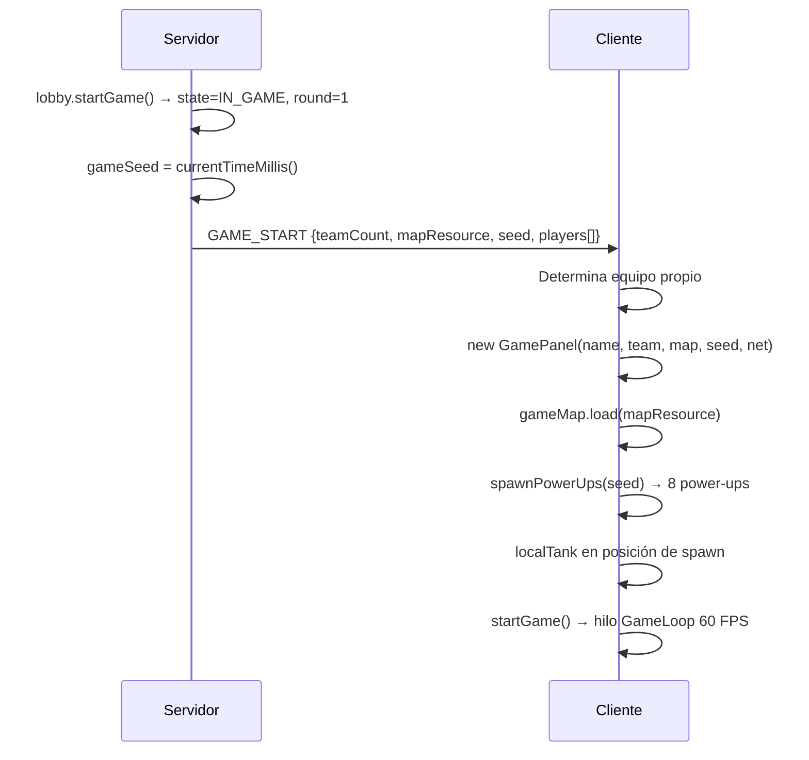
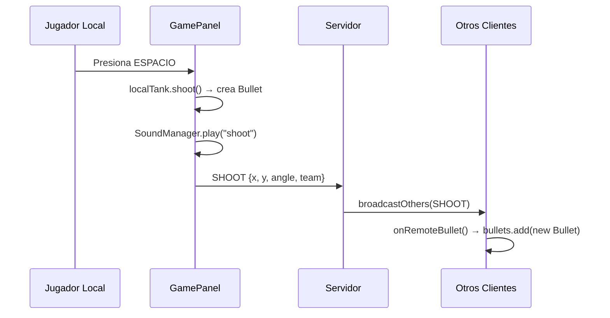
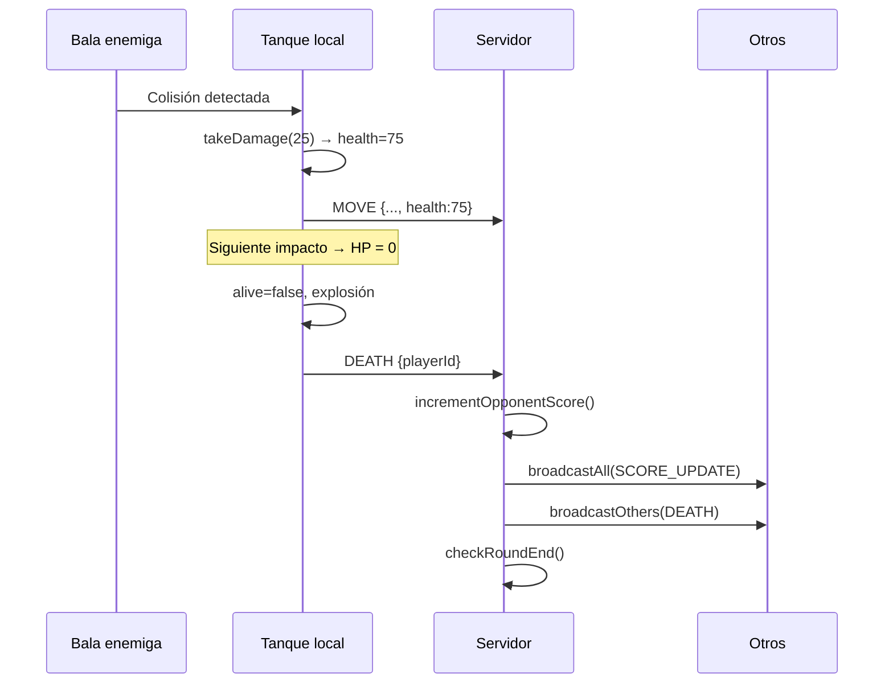
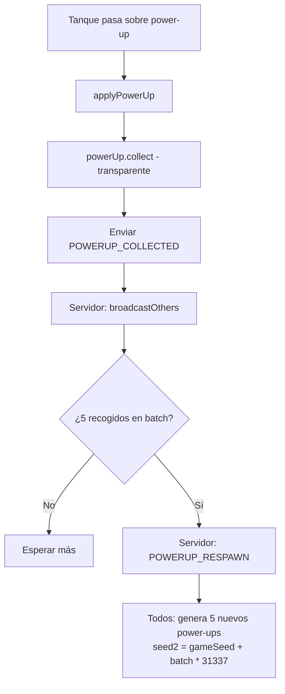
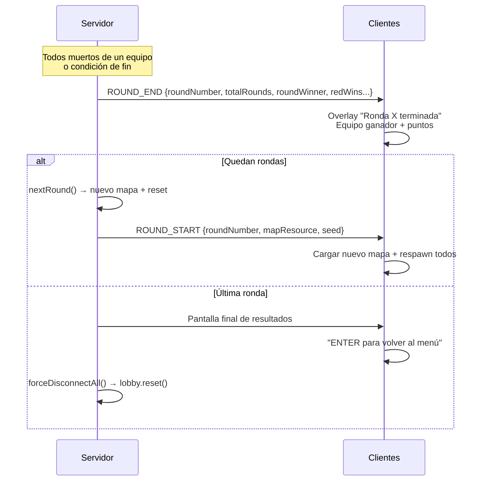
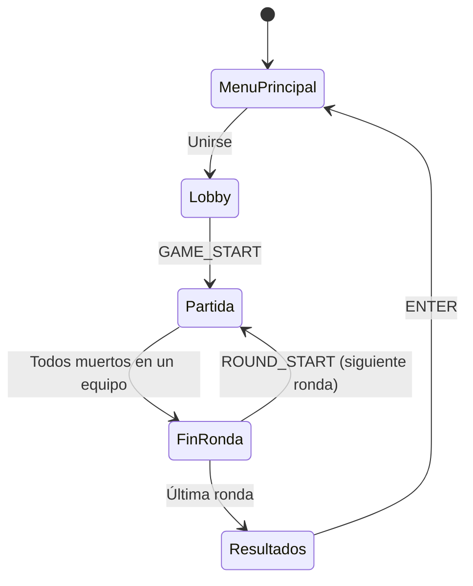

---
tags:
  - universidad
  - proyecto
  - tank-wars
  - flujo
  - gameplay
---

# Flujo Completo del Juego — Tank Wars

> [!tip] Navegación
> [[Documentación del Cliente — ClientCloud|← Cliente]] | [[Documentación — Tank Wars|Índice]] | [[Red e Infraestructura — Tank Wars|Red →]]

---

## Fase 1: Inicio del Cliente



---

## Fase 2: Menú Principal

El jugador rellena dos campos:

| Campo | Opciones |
|---|---|
| **Nombre** | Texto libre (ej. `Player247`) |
| **Número de equipos** | 2, 3, o 4 equipos |

Al pulsar **"UNIRSE A PARTIDA"**:



---

## Fase 3: Conexión al Servidor



---

## Fase 4: Sala de Espera (Lobby)

### Estado WAITING

El `LobbyPanel` muestra los equipos con sus jugadores:

```
┌─────────────┐  ┌─────────────┐
│   ROJO      │  │   AZUL      │
│ ► Player247 │  │  [vacio]    │
│  [vacio]    │  │  [vacio]    │
└─────────────┘  └─────────────┘

0 / 4 jugadores — Esperando...
```

### Auto-Start (Countdown)

Cuando todos los equipos tienen al menos 2 jugadores:



> [!warning]
> Si un jugador se va durante el countdown y el mínimo ya no se cumple, se cancela y se vuelve a `WAITING`.

---

## Fase 5: Inicio de la Partida



---

## Fase 6: Partida en Curso

### Bucle de Juego (cada frame ~16.6 ms)

1. **Lee teclado** → mueve/rota tanque local
2. **Verifica colisiones** con paredes y tanques remotos
3. **Dispara** si ESPACIO + cooldown ok
4. **Envía mensajes al servidor** (MOVE, SHOOT, DEATH, POWERUP_COLLECTED)
5. **Procesa mensajes** sobre los demás jugadores

### Flujo de un Disparo



### Flujo de un Impacto y Muerte



### Reaparición

> [!info]
> El jugador muerto puede reaparecer hasta **2 veces por ronda** pulsando **R**.

---

## Fase 7: Power-Ups

### Generación (Inicio de Ronda)

```java
Random rng = new Random(gameSeed);
// Encuentra celdas libres → mezcla con rng (determinista)
// Toma las primeras 8 → asigna tipos balanceados
// Todos los clientes obtienen los mismos 8 items
```

### Ciclo de Recolección y Respawn



---

## Fase 8: Fin de Ronda



---

## Resumen del Ciclo de Vida Completo



---

> [!tip] Navegación
> [[Documentación del Cliente — ClientCloud|← Cliente]] | [[Documentación — Tank Wars|Índice]] | [[Red e Infraestructura — Tank Wars|Red →]]
