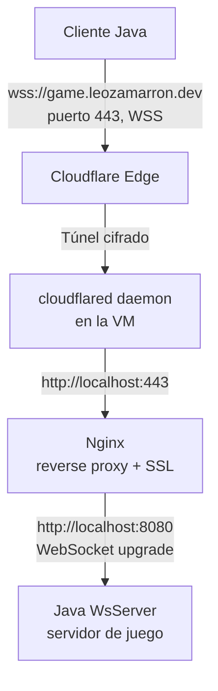
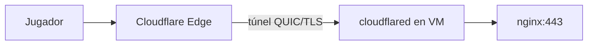
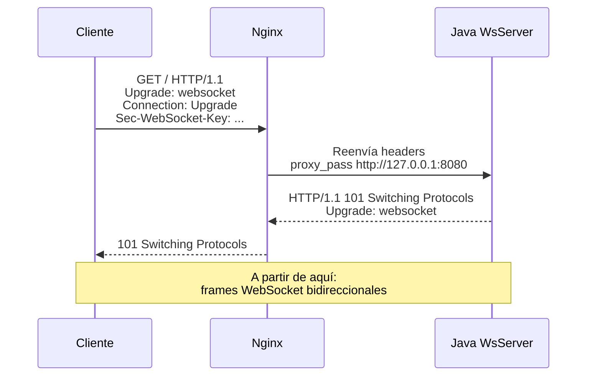
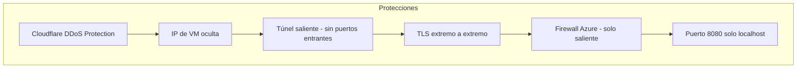

---
tags:
  - universidad
  - proyecto
  - tank-wars
  - infraestructura
  - red
  - azure
  - cloudflare
  - nginx
---

# Red e Infraestructura — Tank Wars

> [!tip] Navegación
> [[Flujo Completo del Juego — Tank Wars|← Flujo]] | [[Documentación — Tank Wars|Índice]] | [[Arquitectura General — Tank Wars|Arquitectura →]]

---

## Visión General

El juego usa una cadena de cuatro capas entre el jugador y el servidor:



---

## Cloudflare

### Rol

Cloudflare actúa como el punto de entrada público para todos los jugadores:

| Función | Detalle |
|---|---|
| **DNS** | `game.leozamarron.dev` apunta a servidores de Cloudflare (no a la VM) |
| **Proxy** | Oculta la IP real de la VM, protege contra DDoS |
| **TLS** | El cliente negocia TLS con Cloudflare (certificado de Cloudflare) |
| **WebSocket** | Configurado para dejar pasar conexiones `Upgrade: websocket` |

> [!important] ¿Por qué Cloudflare?
> Sin Cloudflare, la VM tendría que exponer el puerto 443 directamente a internet. Con Cloudflare:
> - La IP de la VM **nunca** es visible para los jugadores
> - Cloudflare absorbe ataques volumétricos
> - HTTPS/WSS gratuito sin gestionar certificados Let's Encrypt

---

## cloudflared — Túnel de Cloudflare

### ¿Qué Es?

`cloudflared` es un daemon que corre en la VM y mantiene una **conexión persistente saliente** hacia los servidores de Cloudflare.

### Ventaja Clave

> [!success] Sin puertos abiertos
> El túnel es una conexión **saliente** desde la VM. **No necesitas abrir ningún puerto entrante** en el firewall de Azure para el tráfico de los jugadores.

### Flujo del Túnel



---

## Nginx

### Configuración Completa

```nginx
# Redirigir HTTP a HTTPS
server {
    listen 80;
    server_name game.leozamarron.dev;
    return 301 https://$host$request_uri;
}

# HTTPS + WebSocket proxy
server {
    listen 443 ssl;
    server_name game.leozamarron.dev;

    ssl_certificate     /etc/ssl/cloudflare/origin.pem;
    ssl_certificate_key /etc/ssl/cloudflare/origin.key;

    ssl_protocols       TLSv1.2 TLSv1.3;
    ssl_ciphers         HIGH:!aNULL:!MD5;

    location / {
        proxy_pass http://127.0.0.1:8080;
        proxy_http_version 1.1;
        proxy_set_header Upgrade $http_upgrade;
        proxy_set_header Connection "Upgrade";
        proxy_set_header Host $host;
        proxy_set_header X-Real-IP $remote_addr;
        proxy_set_header X-Forwarded-For $proxy_add_x_forwarded_for;
        proxy_read_timeout 86400;
    }
}
```

### Explicación de Directivas

| Directiva | Valor | Por Qué |
|---|---|---|
| `listen 443 ssl` | Puerto HTTPS | El túnel cloudflared entrega el tráfico aquí |
| `ssl_certificate` | Certificado origen Cloudflare | TLS entre cloudflared y nginx (encriptación extremo a extremo) |
| `proxy_http_version 1.1` | HTTP/1.1 | **Obligatorio** para WebSocket — HTTP/1.0 no soporta Upgrade |
| `proxy_set_header Upgrade` | `$http_upgrade` | Pasa el header de upgrade para WebSocket |
| `proxy_set_header Connection "Upgrade"` | literal | Header requerido por el protocolo WebSocket |
| `proxy_read_timeout 86400` | 24 horas | Evita que nginx cierre conexiones de jugadores inactivos |

### El Upgrade de WebSocket Explicado



---

## Java WsServer (Puerto 8080)

```java
new WsServer(8080)        // bind en 0.0.0.0:8080
server.setReuseAddr(true)  // permite reiniciar rápido
```

> [!warning] Seguridad
> El puerto 8080 **nunca** debe ser accesible directamente desde internet. El firewall de Azure debe bloquear el 8080 externo. Solo recibe conexiones de nginx en `localhost:8080`.

---

## Servicio Systemd — tankesitos.service

```ini
[Unit]
Description=Tankesitos Game Server
After=network.target

[Service]
Type=simple
User=azureuser
WorkingDirectory=/home/azureuser/juego/Proyecto-C-mputo-en-la-Nube-Videojuego/TankesitosServer
ExecStart=/usr/bin/java -jar target/TankesitosServer-1.0.jar
Restart=always
RestartSec=5
StandardOutput=journal
StandardError=journal

[Install]
WantedBy=multi-user.target
```

| Directiva | Significado |
|---|---|
| `After=network.target` | Espera a que la red esté lista |
| `Restart=always` | Reinicia el servidor si cae |
| `RestartSec=5` | Espera 5s antes de reiniciar |
| `StandardOutput=journal` | Logs en `journalctl` |

### Comandos Útiles

```bash
# Ver estado
systemctl status tankesitos

# Ver logs en tiempo real
journalctl -u tankesitos -f

# Reiniciar
sudo systemctl restart tankesitos

# Ver últimas 50 líneas de log
journalctl -u tankesitos -n 50
```

---

## Seguridad

### Capas de Protección



| Capa | Protección |
|---|---|
| Cloudflare | Absorbe DDoS, oculta IP real |
| cloudflared | Conexión saliente — sin NSG rules de entrada |
| Nginx TLS | Certificado origen Cloudflare (no Let's Encrypt) |
| Firewall Azure | Solo permite tráfico saliente |
| Binding local | WsServer solo acepta desde localhost |

---

## Latencia

| Tramo | Latencia típica |
|---|---|
| Cliente → Cloudflare Edge | 5–20 ms (CDN global) |
| Cloudflare → VM (túnel) | 10–30 ms |
| nginx → Java | < 1 ms (localhost) |
| **Total estimado** | **15–50 ms** |

> [!note]
> Para un videojuego en tiempo real, esta latencia es aceptable. WebSocket evita el overhead de HTTP por cada mensaje (sin handshakes repetidos).

---

> [!tip] Navegación
> [[Flujo Completo del Juego — Tank Wars|← Flujo]] | [[Documentación — Tank Wars|Índice]] | [[Arquitectura General — Tank Wars|Arquitectura →]]
