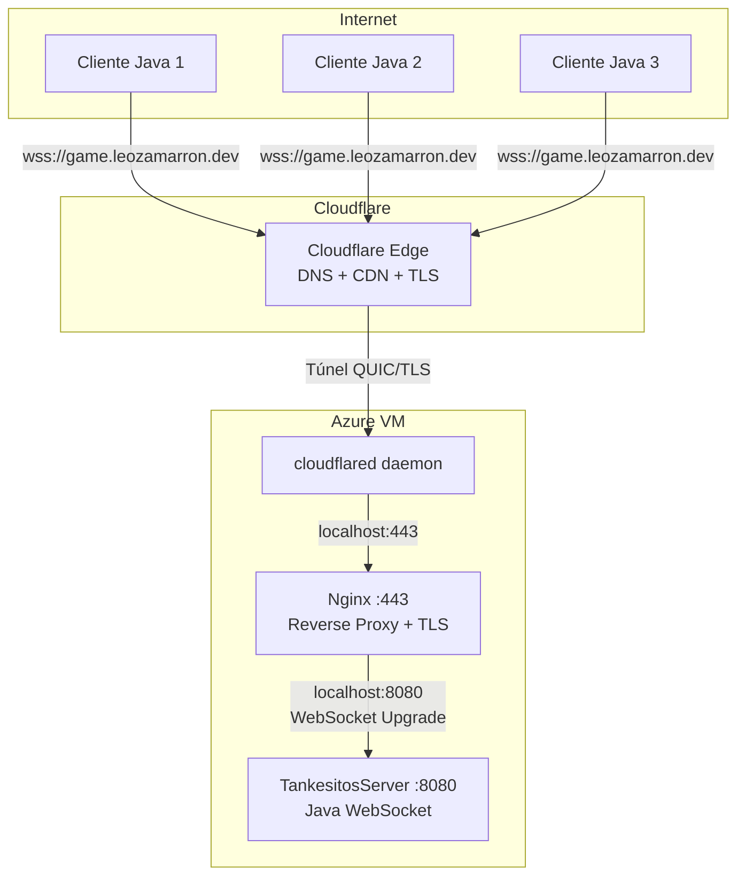

---
tags:
  - universidad
  - proyecto
  - tank-wars
  - moc
aliases:
  - Tank Wars
  - Índice Tank Wars
---

# 🎮 Tank Wars — Documentación del Proyecto

Documentación técnica del proyecto **Tank Wars**, un videojuego multijugador de tanques en tiempo real desarrollado en Java para la materia de **Cómputo en la Nube**.

---

## Mapa de Contenido

| Documento | Descripción |
|---|---|
| [[Arquitectura General — Tank Wars]] | Visión general del sistema: VM en Azure, Nginx, Cloudflare Tunnel, servidor Java. Diagramas de arquitectura y capas. |
| [[Documentación del Servidor — TankesitosServe]] | Documentación detallada del servidor: clases, lógica de lobby, rondas, concurrencia y protocolo de mensajes. |
| [[Documentación del Cliente — ClientCloud]] | Documentación del cliente: pantallas, game loop, entidades, controles y sistema de audio. |
| [[Flujo Completo del Juego — Tank Wars]] | Flujo completo desde que el jugador abre el cliente hasta que termina la partida, con diagramas de mensajes de red. |
| [[Red e Infraestructura — Tank Wars]] | Detalles de la capa de red: Cloudflare, cloudflared, Nginx, WebSocket upgrade, systemd, seguridad y latencia. |

---

## Tecnologías Clave

| Tecnología | Uso |
|---|---|
| **Java 18** (cliente) / **Java 11** (servidor) | Lenguaje principal |
| **Swing** | Interfaz gráfica del cliente |
| **org.java-websocket 1.5.4** | Comunicación en tiempo real |
| **Gson 2.10.1** | Serialización JSON |
| **Maven** | Gestión de dependencias y fat-JAR |
| **Azure VM** | Máquina virtual en la nube |
| **systemd** | Servicio del servidor en la VM |
| **Nginx** | Reverse proxy con soporte WebSocket y TLS |
| **Cloudflare Tunnel (cloudflared)** | Acceso seguro sin exponer IP pública |

---

## Estructura del Repositorio

```
Proyecto-Cómputo-en-la-Nube-Videojuego/
├── TankesitosServer/          ← Código del servidor (Java 11)
│   ├── src/
│   │   ├── main/              ← Lógica principal
│   │   └── json/              ← Modelos de mensajes
│   └── target/
│       └── TankesitosServer-1.0.jar  ← Fat JAR desplegado
│
├── ClientCloud/               ← Código del cliente (Java 18)
│   └── src/main/java/client/
│       ├── game/              ← Pantallas y game loop
│       ├── net/               ← Comunicación WebSocket
│       └── entity/            ← Entidades del juego
│
└── docs/                      ← Esta documentación
```

---

## Inicio Rápido

### Ejecutar el Servidor

```bash
# En la VM de Azure (ya configurado como servicio)
systemctl status tankesitos        # Ver estado
journalctl -u tankesitos -f        # Ver logs en vivo
systemctl restart tankesitos       # Reiniciar tras actualización

# O manualmente:
cd TankesitosServer
java -jar target/TankesitosServer-1.0.jar
```

### Ejecutar el Cliente

```bash
cd ClientCloud
java -jar target/ClientCloud-1.0-SNAPSHOT.jar

# Para apuntar a un servidor local:
echo "SERVER_URL=ws://localhost:8080" > .env
java -jar target/ClientCloud-1.0-SNAPSHOT.jar
```

### Compilar

```bash
# Servidor
cd TankesitosServer && mvn package

# Cliente
cd ClientCloud && mvn package
```

---

## Diagrama General de Arquitectura



---

> [!info] Navegación
> Este es el índice principal. Navega a cada sección usando los enlaces del [[#Mapa de Contenido]].
